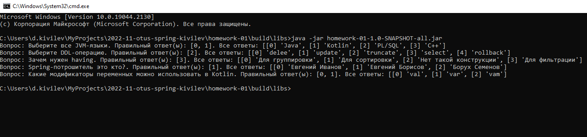

# Homework - 01

Приложение по проведению тестирования студентов - только вывод вопросов и вариантов ответа (если имеются)  

**Цель**: создать приложение с помощью Spring IoC, чтобы познакомиться с основной функциональностью IoC, на которой строится весь Spring.  

**Результат**: простое приложение, сконфигурированное XML-контекстом.  

## Запуск из Jar

1. Выполнить команду из корня проекта: gradlew clean assemble shadowJar
2. Перейти в каталог build/libs
3. Выполнить команду: java -jar homework-01-1.0-SNAPSHOT-all.jar  

