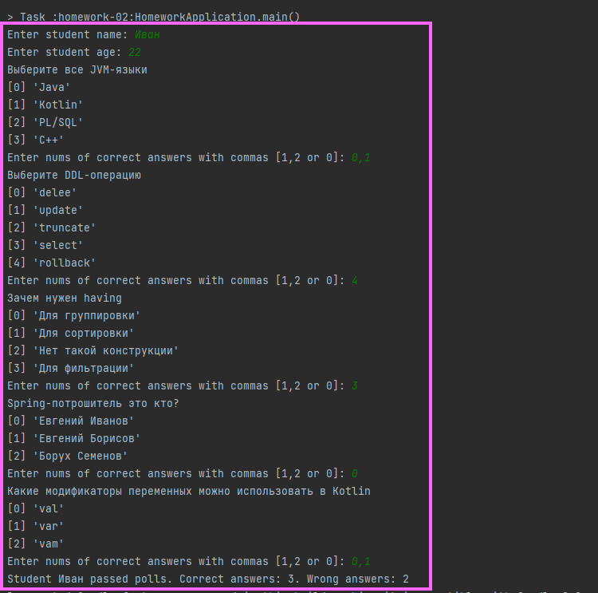

# Homework - 02

Приложение по проведению тестирования студентов (с самим тестированием)

**Цель**: конфигурировать Spring-приложения современным способом, как это и делается в современном мире 

**Результат**: готовое современное приложение на чистом Spring

## Запуск из Jar

1. Выполнить команду из корня проекта: gradlew clean assemble shadowJar
2. Перейти в каталог build/libs
3. Выполнить команду: java -jar homework-01-1.0-SNAPSHOT-all.jar  

