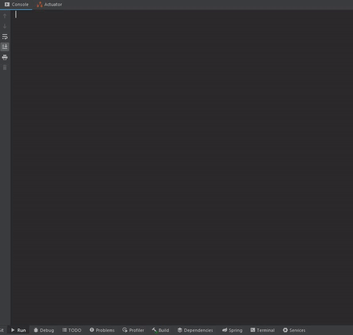

# Homework - 03

Приложение по проведению тестирования студентов (с самим тестированием)

**Цель**: использовать возможности Spring Boot, чтобы разрабатывать современные приложения, так, как их сейчас и разрабатывают. 

**Результат**: Production-ready приложение на Spring Boot

## Запуск из Jar

1. Выполнить команду из корня проекта: gradlew clean assemble
2. Перейти в каталог build/libs
3. Выполнить команду: java -jar homework-03-spring-boot-1.0-SNAPSHOT.jar

