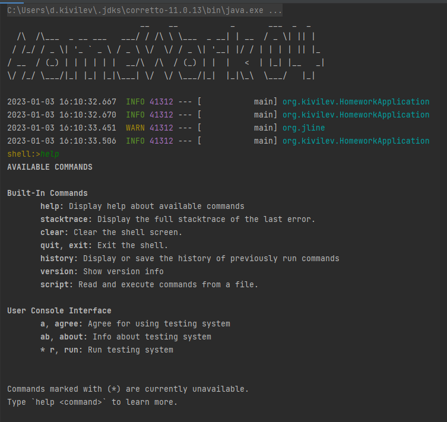

# Homework - 04

Приложение по проведению тестирования студентов (с самим тестированием)

**Цель**: после выполнения ДЗ вы сможете использовать Spring Shell, чтобы писать интерфейс приложения без Web. 

**Результат**: Приложение на Spring Shell

## Запуск из Jar

1. Выполнить команду из корня проекта: gradlew clean assemble
2. Перейти в каталог build/libs
3. Выполнить команду: java -jar homework-04-spring-boot-1.0-SNAPSHOT.jar  

