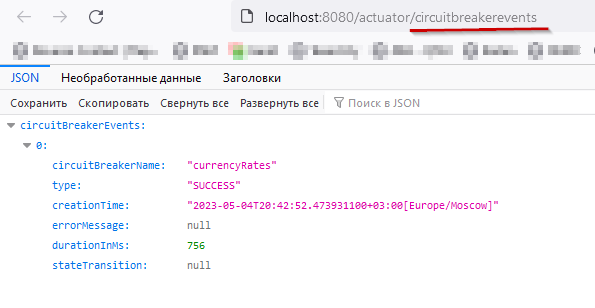
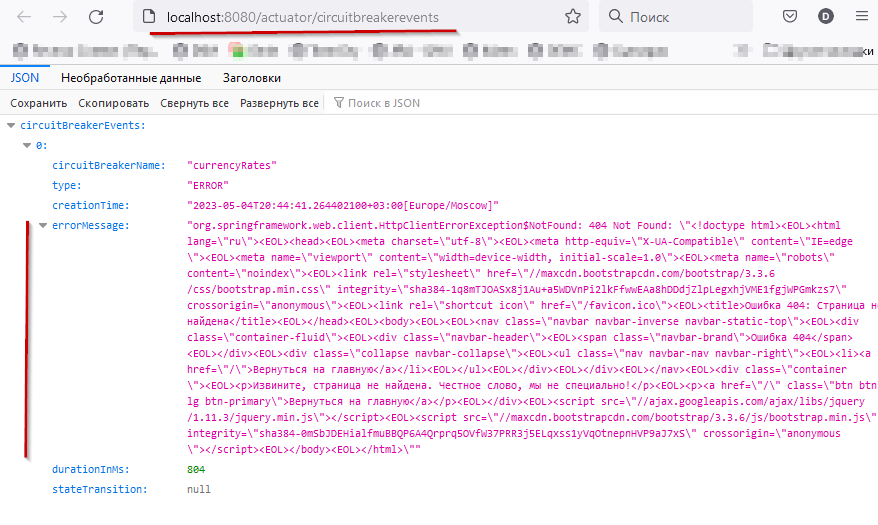

# Homework - 18

### Обернуть внешние вызовы в Hystrix

**Цель**: сделать внешние вызовы приложения устойчивыми к ошибкам

**Результат**: приложение с изолированными с помощью Hystrix внешними вызовами

**Выполнение:**  
Для более интересного решения добавил получение курса валют с ЦБ РФ. И вывод на Web-страничке в меню под книгами.  
Из особенностей:
- использование FeignClient;
- кэширование запросов раз в 10 секунд;
- использование паттерна Circuit Breaker.

**Данные для диагностики:**
1. http://localhost:8080/actuator/circuitbreakers/
2. http://localhost:8080/actuator/circuitbreakerevents/
3. http://localhost:8080/actuator/caches/

Работа предохранителя в нормальном режиме:  

Предохранитель отрабатывает отсутствие подключения:  

Команды:  
docker-compose up --build  
docker-compose down

